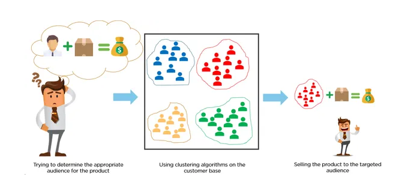

# K-Means_customer_segmentation_project
<h2>K_MEANS Customer Segmentation Project</h2>

K-means clustering or K-means clustering method is to partition a data set consisting of N data objects into K clusters given as input parameters.
 

The aim is to ensure that the intra-cluster similarities of the clusters obtained as a result of the partitioning process are maximum and the inter-cluster similarities are minimum.

K-means is one of the most commonly used clustering algorithms. It is easy to apply. It can cluster large-scale data quickly and efficiently. 

“K” refers to the fixed number of clusters needed before starting the algorithm. With its recursive partitioning structure, the K-means algorithm reduces the sum of the distances of each data to the cluster it belongs to. K-means algorithm tries to identify K clusters that will minimize the squared error.

<h2>The algorithm basically consists of 4 stages:</h2>

1. Determination of cluster centers
2. Clustering data outside the center according to their distance
3. Determining new centers according to the clustering (or shifting old centers to the new center)
4. Repeat steps 2 and 3 until a stable state is reached.